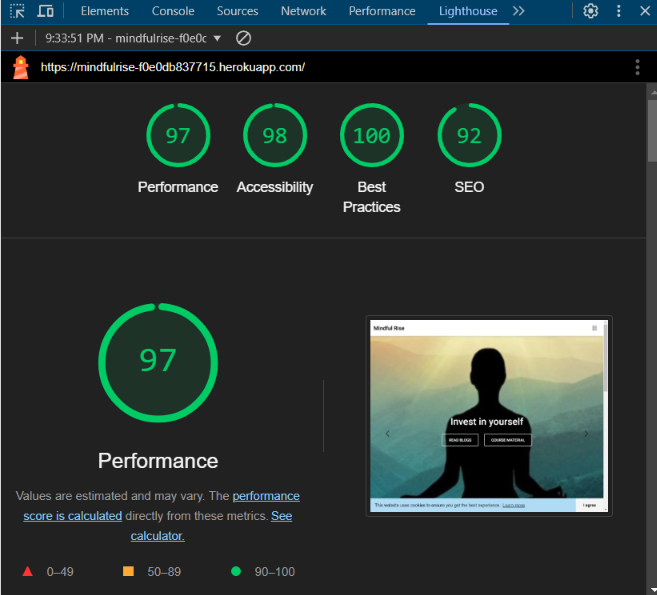

## Introduction

Mindful Rise is a platform designed to explore and deepen your understanding of mindfulness, self-development, and methods to achieve a more significant and elevated self. It's a place where you can connect with like-minded individuals and make new friends through engaging with comments and discussions. The platform also features a like system on the index page, helping you easily find the most popular and interesting blogs. By signing up as a member, you gain full access to all content and features.

#### Live web site: https://mindfulrise-f0e0db837715.herokuapp.com/

### Content

* [Project Set Up](#project-set-up)
* [Agile methods - User stories](#agile-methods-user-stories)
* [mindmap](#Mindmap)
* [erd](#erd)
* [wireframes](#Wireframes)
* [crud](#CRUD)
* [feature](#Features)
* [Setting up workspace](#setting-up-workspace)
* [design](#Design)
* [testing](#Testing)
* [bugs](#Bugs)
* [technologies](#Technologies)
* [packages](#packages)
* [deployment](#Deployment)
* [database](#database)
* [framework](#Framework)
* [icons](#Icons)
* [media](#Media)
* [image](#Images)
* [acknowledgements](#Acknowledgements)

### Project Set Up
I began this project with the idea of creating a blog.
To add more exclusive content, I decided to include a page with courses to further delve into self-development.

I started with a mindmap to brainstorm ideas and drew wireframes for the content and design of the site.
I initiated the project in GitHub, where I created user stories to guide development.

Afterwards, I created an ERD (Entity Relationship Diagram) to plan out the structure of the project.

In Gitpod, I chose to have a single app since the blog and courses are integrated but filtered on their respective pages. I created different templates to streamline the workflow.

#### Agile methods - User stories

During the project setup, I created a repository named "Mindful Growth" and a project to accompany it. 
However, I encountered numerous issues in Gitpod, leading me to start over from scratch with a new repository,
renaming the blog to "Mindful Rise."
I linked the original project to the new repository, but later realized that the link wasn't functioning correctly, preventing me from connecting to my user stories.
Consequently, I created a new project named "Mindful Rise" and developed new milestones and user stories/tasks.
This decision helped me restructure and clean up the agile workflow.

In the backlog, I worked through different stories/tasks, moving them through stages until they were completed. I created user stories with acceptance criteria to achieve a Minimum Viable Product (MVP).

Link to my project in GitHub:

https://github.com/users/Christina5P/projects/7/views/1?visibleFields=%5B%22Title%22%2C%22Assignees%22%2C%22Status%22%2C%22Milestone%22%5D

### Mindmap

link to my mindmap: https://miro.com/app/board/uXjVK1IKqsk=/

### Relationship diagram ERD

Link: https://drive.google.com/file/d/1SYwaMzGs6PuOuEuA6Yi4T2Q0p8dvmSvd/view?usp=sharing

### Wireframes

The Wireframe were created using https://balsamiq.cloud/srvezeo/phn02iw/r3EBE

Wireframes

Home page:

Blog page:

Courses:

Blogpost:

### CRUD 

CRUD Operations
The platform utilizes the following CRUD operations:

Create: Users can create comments and like posts, as well as register an account.
 
Read: Users can view the homepage, blog posts, and course material.
 
Update: Users can edit their own comments or unlike their likes if they have created an account and are logged in.
 
Delete: Users can delete their own comments if they have created an account and are logged in.

## Features

Features

## Home Page

The homepage serves as the first impression and plays a crucial role in capturing users' interest. 
It features a half-carousel with images appealing to those interested in self-investment. 
Below the images, I included a brief introduction of myself to build trust and connection with the users, 
along with a photo of myself to strengthen that bond.

### Blog Page
The blog page is accessible to all visitors. 
If you haven't signed up, you can still read the posts. 
The blog page features a clean and calm design. Users can select categories of interest,
and the buttons reflect the chosen category through a calm highlight color.
It also starts with an "All Categories" button to ensure clear and easy navigation.

Additionally, a free text search bar allows for searching blog posts by category. A clear button lets users quickly return to all posts, making searches easy.

When you open  a post, you see a button to quickly come back to the index again.

If you find an interesting post, you have the option to share it on social media below the posts.

Users must be logged in to like or comment on a post. For admins, it’s easy to approve comments using a filter option that allows multiple comments to be approved simultaneously. After a while I decided the comments should be proved without admins authorization.
Users can also edit or delete their comments and receive alerts or flags to confirm actions like deleting a post. The page also features counters for likes and comments.

If there´s no post in a category, you get a message,so you understand that there is no published posts.

The blog index has a paginator, allowing you to navigate between pages using "previous" and "next," and see how many pages there are.

### Courses
The courses page is more exclusive and available only to members.
When logged in, users are greeted with a welcome message and can access the course material below the message.

If you're not signed in, you'll see a form in the center of the page with links to log in or sign up.
The course material is not visible to unauthorized users.
 

I didn´t fint it necessary to have a paginator to this page.

### Nav Bar

The navbar is located at the top of the page and contains the same information across pages,
with the color changing to maintain contrast as you navigate. 
On the right side, users can see whether they are logged in or not. If logged in, 
there's a "Logout" option; otherwise, "Register" and "Login" options are displayed.

### Footer

The footer contains links to social media and a copyright text.

### Register section

Sign Up/Sign In

The register section, powered by Django Allauth, allows users to register with a username and password. 
The sign-up button is styled with MDB.

## 404 error
A custom 404-page is included for a more personal interaction, ensuring users remain within the Mindful Rise community even when an error occurs. A link is provided to easily return to the previous page.

### Favicon
A custom favicon, designed as a logo, is included in the head section of the blog site.

### Cookies
As a best practice from Lighthouse, I implemented a cookie consent to inform users about the use of cookies.
I chose the Cookie Consent library by Insites for its ease of implementation.

### Setting up workspace

Set up Gitpod

1.Run this command to install Django:

Next, install these libraries:

Create a requirements.txt file to save all the installed libraries:

Create a project and add your apps:

Remember to add your apps to the INSTALLED_APPS in settings.py.

Add your database and Cloudinary library to your project:

* Copy the DATABASE_URL.
* Create a new file named env.py.
* Place this file in the project directory.
* Import the os library:

Set environment variables:

Link this to your settings.py by importing the env file at the top:

 
Run the following command:

Create a superuser for your database to access the admin panel:

### Design

Colors, Typography,

Colors:
I chose earthy and neutral tones to enhance a calm and mindful feeling. 
Light colors dominate the site to avoid overwhelming users.

Typography:
Heading: 'Roboto', sans-serif; with styles ranging from light to bold.

Body: 'Noto Serif', serif; for a calm and professional look.

I didnt install anything from MDB since I used CDN installment. It is the easiest way, since you only need to add MDB:s link tap in <head> in your base.html 

### Testing

Validators

* HTML Validation 
W3C Validator HTML

* CSS validation
W3C Validator CSS

* Javascript
JS Hint

* Python PEP8

Other Tests

* Lighthouse

* Wave

#####  Manual testing

I have tested every function throughout the work.
In the end, I have tested every user story in Herokuapp, 

check my document: https://docs.google.com/document/d/1hwgkt8NEOS9-HmkjSEQ4gG_kMfmFePpCXCL0mPBnGMg/edit?usp=drive_link

I have tested "forgot password" in the Log In section, by add a backend email in settings.
EMAIL_BACKEND = 'django.core.mail.backends.console.EmailBackend'

### Bugs

check my document for bugs and status:

https://docs.google.com/document/d/1TzJtZ0N6RMryrJDhrG67TnzF51-qiSbdxDfFVO30f38/edit?usp=sharing

### Technologies
* Python - Language of this project
* Javascript
* JQuery
* HTML
* CSS
* Django - 
* Cloudinary (for external image management)
* Code Institute Postgres Database server for PostgreSQL 
* MDB
* Github - Save the project in a repository
* Heroku - Deploy it to a public website

#### Packages
* Whitenoise
* Summernote
* Cloudinary

## Deployment

Deployment

For deploying, I use the Heroku app.
At first, you commit everything to GitHub.
In Heroku, you set up an app for the project and deploy the changes you make to the public site.

### Heroku
You connect the app to your repository in GitHub with the same name.
I chose to make a manual deployment, so I can see that everything goes ok and have control of my project.

You need to create an app for your project in Heroku.
In settings you also need to fill in the URL:s in Config Var

After that you go to Herokus deployment section 

Scroll down to the bottom and click the "deploy button

On the top at right hand side, you can click "open app" to see public site.
If there is any error, you can find the logs if you click "more" button.

### Git Hub / Gitpod
I created a repository in Git Hub and connected a project to the repository.

In the project, I worked with the canban and created the user stories there.

When I add, deleated or changed anything in Gitpod, I committed them back to GitHub using the following commands in the codespace terminal: Git add .
Git commit -m"text"
Git push

To run a backend application in Gitpods terminal,
type: python3 manage.py runserver 

To see and implement changes in Django, type:
python3 manage.py makemigrations
pyhton3 manage.py migrate

### How to Fork
To fork this repository, click the "Fork" button at the top right corner of the main repository page. On the "Create a Fork" page, you can change the name of the repo if desired. Check the box if you want to copy the main branch or multiple branches (main is selected by default). Then, create the fork.

### How to Clone (An alternative to fork)
To clone the repository, you create a copy in your repository (with all files and history).
This creates a remote link to the original repo, allowing you to work in your copy and push changes back to the original.
Open your repo and click the green "Code" button on the right-hand side. The easiest way is to open it with GitHub Desktop.

You can read more information on cloning at the GitHub : https://docs.github.com/en/repositories/creating-and-managing-repositories/cloning-a-repository

### Database
CI Database https://dbs.ci-dbs.net/

### Framework 
* Django

### Icons

* https://www.flaticon.com/free-icons/author
* https://www.flaticon.com/free-icon/philosophy_4576683?term=mindfulness&page=1&position=3&origin=tag&related_id=4576683

## Media

* https://www.youtube.com/watch?v=et55Kc_G-1o
* https://deepeddypsychotherapy.com/self-esteem/
* https://www.verywellhealth.com/what-is-self-esteem-5205044
* https://www.yin-yoga.se/yinyoga/
* https://www.masterclass.com/articles/how-to-value-yourself
* https://www.shutterstock.com/
* https://www.betterup.com/blog/manifestation-methods
* https://www.youtube.com/watch?v=1vx8iUvfyCY&list=PLO9OtUmChpP-yR2HBZyf-5MGOtOWlfPil

### Images
* https://deepeddypsychotherapy.com/self-esteem/
* https://www.wfla.com/bloom-tampa-bay/unlocking-your-inner-confidence-the-power-of-self-esteem/
* https://www.yin-yoga.se/yinyoga/
* https://www.psychalive.org/self-worth/
* https://foreverconscious.com/really-manifest-life-want

## Acknowledgements

I would like to thank my tutor for their guidance throughout this project. 
Additional thanks go to my studyfellow Josefin Dahlquist,all time she has spend on me to help, inspirate and stay with my side the whole project.

#### for tutoring Django:
* https://youtube.com/playlist?list=PLXuTq6OsqZjbCSfiLNb2f1FOs8viArjWy&si=9t7TdLJVAM9BM9Ga
* https://realpython.com/build-a-blog-from-scratch-django/#set-up-the-development-environment 
* https://www.youtube.com/watch?v=ZUiTiUj-tZw
* https://www.youtube.com/watch?v=PXqRPqDjDgc
* https://dev.to/radualexandrub/how-to-add-like-unlike-button-to-your-django-blog-5gkg
* https://medium.com/@peter.bulyaki/ho-to-edit-or-delete-your-comments-responses-on-medium-com-in-2019-2a87eb8da79b
* https://www.youtube.com/watch?app=desktop&v=PXqRPqDjDgc
* https://monica.im/home GPT chat to help explain where to put url, create cookies content,
  explain of Django functions.
* https://chatgpt.com to help me with adding category search button and clear search button with MDB style,
  Suggestion to create excerpt automatically save
* https://www.w3schools.com/howto/howto_website_static.asp

#### Inspiration of blogs and course material
* https://www.progressme.se/sv
* https://www.everydayhealth.com/mindfulness/

